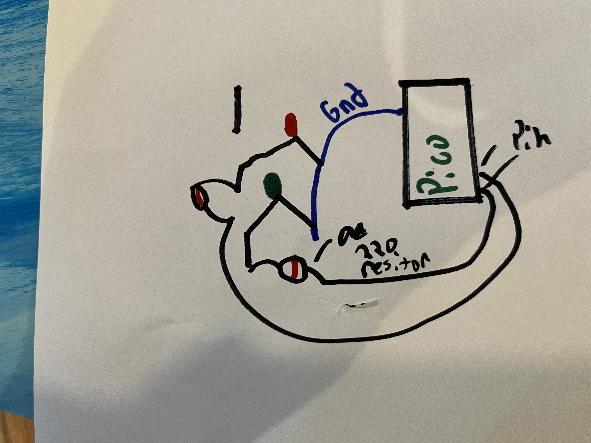
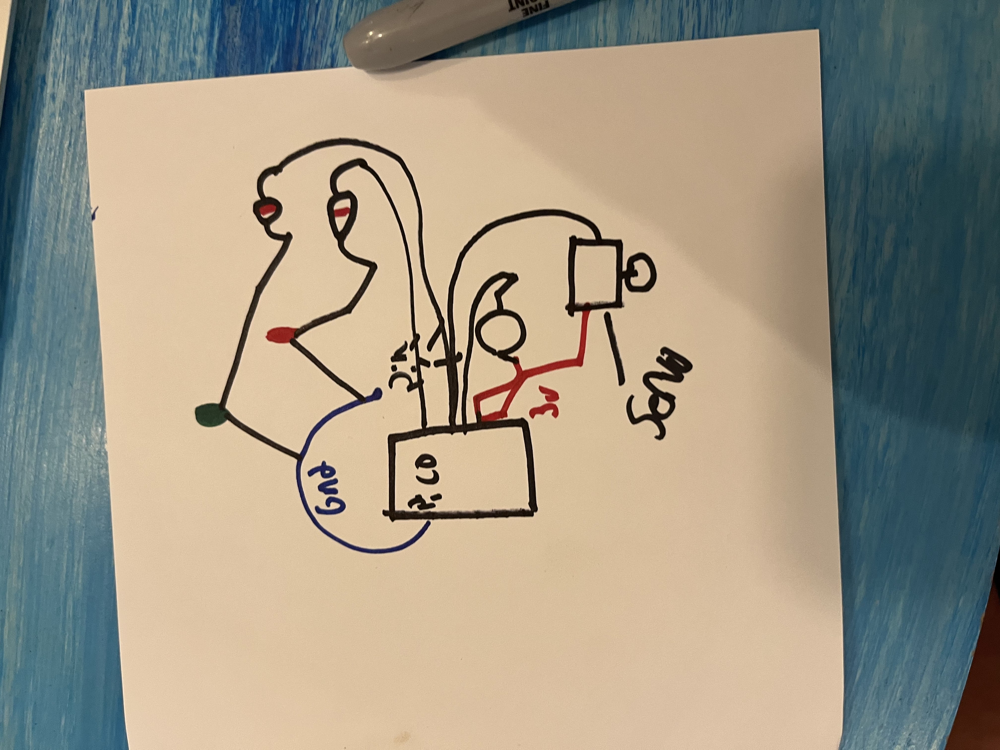
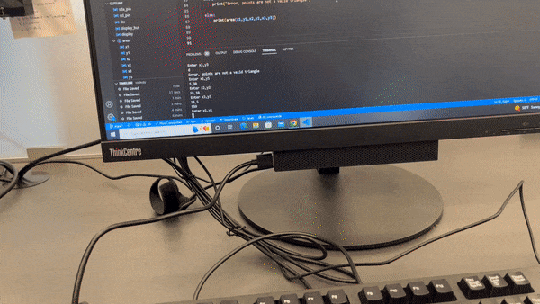
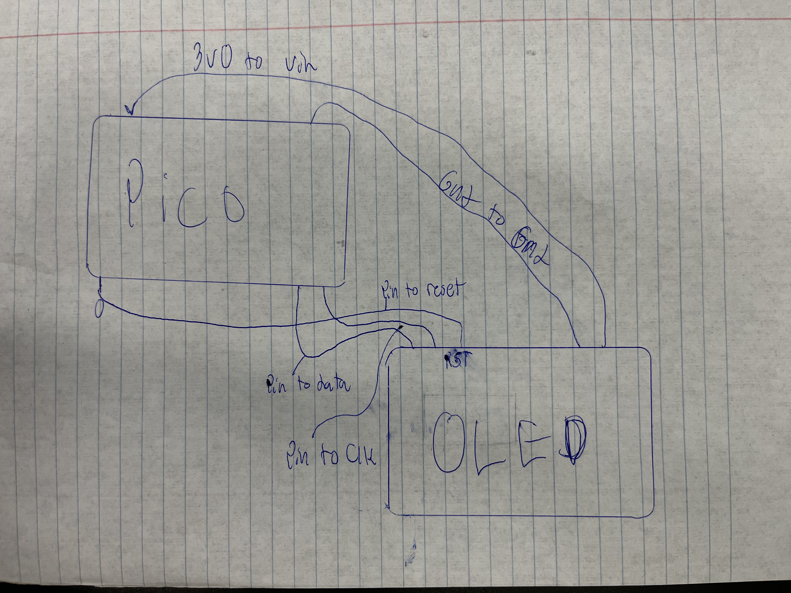

# Engineering_4_Notebook

&nbsp;

## Table of Contents
* [Raspberry_Pi_Assignment_Template](#Raspberry_Pi_Assignment_Template)
* [Onshape_Assignment_Template](#Onshape_Assignment_Template)

&nbsp;

## Launchpad 1

### Assignment Description

Make serial countdown from 10 to 1 and read "Takeoff!"

### Evidence 

 

  

### Wiring

No wiring

### Code
Give me a link to your code. [Something like this](https://github.com/millerm22/Engineering_4_Notebook/blob/main/Raspberry_Pi/hello_world.py). Don't make me hunt through your folders, give me a nice link to click to take me there! Remember to **COMMENT YOUR CODE** if you want full credit. 

### Reflection

The most challenging part of this assingment for me was figuring out the for loop. At first I only had (10, 0) This countdown from 0-10. To do the oppisite and to complete the assingment I had to use "for (0, 10, -1) The -1 clarifies direction which allows the count DOWN.

## Launchpad Part 2

### Assingment description

Have green led to blink every second of countdown and red to go off when countdown is finished.

### Evidence 

  

### Wiring

  width="100" height="100">

### Code

### Reflection

At first I had both legs of the led wired in the same row, which clearly wont work. I then put one leg in the coloumn with ground, and the other with a resitor, with the resistro connected to the desired pin with another wire. V

## Launchpad Part 3

### Assingment description

Same parameters as previous two assignemnts, adding button to initialize coutndown and blinking led.

### Evidence 

  

### Wiring

   

### Code

### Reflection

This assingment retaught me how to use a button. The previous LEDs were an output, whereas the button is an input. At first The button didnt work because I made the mistake of switcthing them, but then it worked.

## Launchpad Part 4

### Assingment description

Have servo turn 180 degrees when button is pressed after the coundown.

### Evidence 

  

### Wiring

   

### Code

### Reflection

After troubleshooting, I still couldn't get servo to work, so I borrowed a classmates (Thanks Aidan) servo who had completed the assingment. The servo then worked. Another problem I had was not starting the servo at 0 degrees, use code ""

## Landing area 1 

### Assingment description

Code asked user to inpput 3 point (x1,y1) etc, when 3 points are entered, code spits out area. If invalid point is entered (d,3) code prints "Error, points are not a valid triangle"

### Evidence 

  

### Wiring

No wiring

### Code

### Reflection

The hardest part of this assingment for me was converting the int to float. To use in equation variable x1,y1 etc have to be integers but for most else they have to be float. To convert to float its as simple as float(x1), to convert back to int in equation int()

## Landing area 2

### Assingment description

Code asked user to inpput 3 point (x1,y1) etc, when 3 points are entered, code spits out area. If invalid point is entered (d,3) code prints "Error, points are not a valid triangle" Graph triangle from 3 points inputed on OLED screen.

### Evidence 

  

### Wiring

### Code

### Reflection

To print the triangles for this assingment you couldnt just input 'triangle = Triangle(int(x1), int(y1), int(x2), int(y2), int(x3), int(y3))'
as this would print the trirangle on the wrong part of the graph. Since the OLED is 128 by 64, to get the tirangle to plot with respect to the origin (64,32) you have to add 64 to each x value (int(x1) + 64) and subtract each y value from 32 (32 - int(y1).

## Onshape_Assignment_Template

### Assignment Description

Write your assignment description here. What is the purpose of this assignment? It should be at least a few sentences.

### Part Link 

[Create a link to your Onshape document](https://cvilleschools.onshape.com/documents/003e413cee57f7ccccaa15c2/w/ea71050bb283bf3bf088c96c/e/c85ae532263d3b551e1795d0?renderMode=0&uiState=62d9b9d7883c4f335ec42021). Don't forget to turn on link sharing in your Onshape document so that others can see it. 

### Part Image

Take a nice screenshot of your Onshape document. 

### Reflection

What went wrong / was challenging, how'd you figure it out, and what did you learn from that experience? Your goal for the reflection is to pass on knowledge that will make this assignment better or easier for the next person. Think about your audience for this one, which may be "future you" (when you realize you need some of this code in three months), me, or your college admission committee!

&nbsp;

## Media Test

Your readme will have various images and gifs on it. Upload a test image and test gif to make sure you've got the process figured out. Pick whatever image and gif you want!

### Test Link

  [Hyperlink text](https://www.youtube.com/watch?v=z4t1CC7-UFE)      

### Test Image

   

### Test GIF

    
